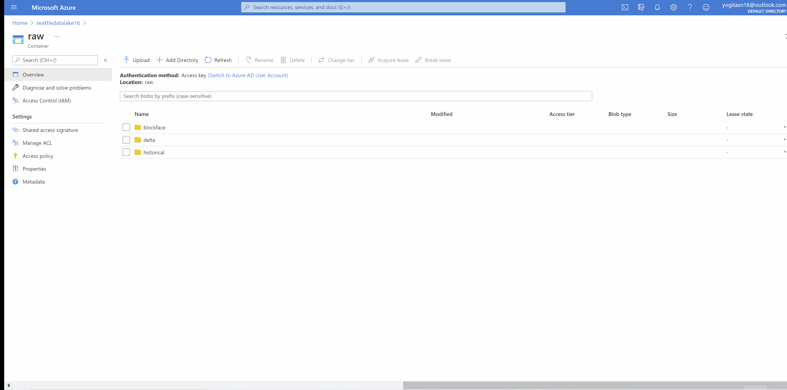

#### Ingestion
The Seattle Parking Occupancy Dataset are csv files provided as Year to Date data from 2012 to present

#### `ingest.py` 
[[Details](https://github.com/yogitasn/seattlepaidparking/wiki/Data-Ingestion)] 
Python script for downloading the files from Seattle Open Data to Azure file share

#### Post Ingestion 
[[Details](https://github.com/yogitasn/seattlepaidparking/wiki/Post-Ingestion-Step)]  
Instructions for moving the files from file share to Azure storage to read them in Pyspark dataframe in the data processing step

### Data Lake 
Data Lake after performing Post Ingestion step

