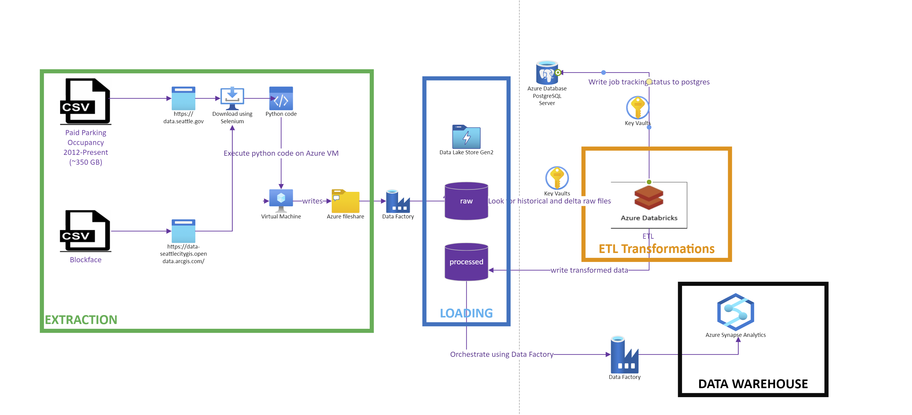

## Table of contents
* [General Info](#general-info)
* [Architecture](#architecture)
* [Overview](#overview)
* [Technologies](#technologies)
* [Execution](#execution)
* [References](#references)


## General Info
This project is Step 9- Deploy the Code and Process the Dataset for Open-Ended project: Seattle Paid Parking Occupancy

<hr/>

## Architecture




## Overview
Car parking has been a major issue in urban areas worldwide. Most countries are facing issues related to the lack of parking places. With the increasing economic development and urbanization, car ownerships are growing rapidly, which exacerbates the imbalance between parking supply and demand [1]. The Ministry of Public Security of China released data on car ownership nationwide in 2018, showing that the number of cars reached 240 million with an annual growth rate of 10.51%, but the total number of parking spaces was only 102.5 million including private and public parking spaces, which is lower than half of the total number of cars. Moreover, around 30% of the traffic congestion in Chongqing and Shanghai, major cities of China, is due to a lack of car parking spaces [2]. This issue is mainly caused by ineffective parking management. According to the latest research report [3], the parking space utilization rate of more than 90% of cities in one of world's most populated countries is <50%. With the limited areas in the cities, increasing parking areas would not be a sustainable solution, but the implementation of efficient parking management would be a practical solution. The intelligent parking system is an essential part of efficient parking management. In an intelligent parking system, the time-sensitive parking occupancy prediction will be of great significance for decision-makers and city planners regarding parking.

The number of available parking spaces plays an important role in drivers’ decision-making processes regarding parking [4, 5]. According to Caicedo et al. [6], drivers that possess information on parking availability are 45% more successful in availing parking spaces than those without knowledge. Moreover, the parking occupancy prediction is helpful in transportation management and planning [7]. For instance, public agencies such as city traffic and planning departments use the predicted parking occupancy information to manage transportation demand and traffic congestion [8]. Parking facility managers and operators may foresee the parking system performance and carry out short- and long-term preventive strategic decisions to avoid system breakdowns [9]. On the other side, the parking occupancy prediction can help reduce traffic congestion and energy consumption [10]. According to a report [11], on average, US drivers spend 17 h per year searching for parking spaces for $345 per driver incurred due to time consumption, fuel, and emissions. If an accurate prediction of parking availability can be provided, drivers can save a lot of time while searching for parking spaces, and energy consumption can be reduced. Thus, the parking occupancy prediction is a critical, but often ignored, element in the transportation system, which can balance the distribution of the occupancy rate of parking lots


Parking issues have been receiving increasing attention. An accurate parking occupancy prediction is considered to be a key prerequisite to optimally manage limited parking resources. However, parking prediction research that focuses on estimating the occupancy for various parking lots, which is critical to the coordination management of multiple parks (e.g., district-scale or city-scale), is relatively limited.

A pipeline is built on the cloud leveraging non-relational storage solutions like Data Lake, Azure Databricks spark processing, and Azure Synapse Analytics

* `Extraction`: The file extraction process is automated using Selenium Python library and headless Chrome driver and saved to Azure Data Lake via Azure Windows VM.
* `Transformation`: After files are extracted, transformations are performed using Pyspark (Python API to support Spark) in Azure Databricks and processed files saved back to Azure Data Lake in parquet files.
* `Orchestration`: Data Factory is used to orchestrate the pipeline to load the historical and delta data into SQL Datawarehouse.

<hr/>

## Technologies
The Project is built with the following technologies on Azure Cloud:

* `Azure Data Lake`: A cloud platform to support big data analytics to store the raw historical data for Seattle Paid Parking and Blockface datasets. (~ 400 GB)
* `Azure Databricks`: A data analytics platform to perform spark transformations on raw datasets in Databricks.
* `Azure Database for Postgres`: A fully-managed database as a service to load the historical and delta job tracking status in a table.
* `Azure Data Factory`: A platform to orchestrate data movement for loading of the historical and delta load datasets in the final Data warehouse
* `Azure Synapse Analytics/Dedicated SQL Pool`: Data warehouse to hold historical and delta records for Seattle Paid Parking and Blockface.
* `Azure Key Vault`: A cloud service for securely storing and accessing secrets.

## ETL Flow

* Historical and Delta Data downloaded from the `Seattle Open Data` and `Seattle GeoData` using python script leveraging Selenium executed on Azure VM, and transferred to Data Lake's raw/historical, raw/delta, and raw/blockface folders.
* Azure Data Factory pipeline is executed that triggers spark processing via Azure Databricks on the raw files in Data lake and applies transformation. Processed parquet files are saved back to the Processed folder in Data Lake.
* After saving the processed parquet files, the pipeline orchestrates the data movement from the processed folder to Dedicated SQL Pool/Azure Synapse Analytics. Loading is one-time for historical data from `2012-2020` and incremental for the current year `2021`
* Pipeline execution completes when the load to the Data warehouse completes.

## Execution

# Extraction

Navigate to the project folder and execute the following commands

* Extraction (Script to download occupancy and blockface CSV files to an Azure file share path: 'Z:\<fileshare>\'

```
python ingest.py

```

Refer to the Readme under the data ingestion folder for detailed steps.

# Transformation

* The driver will call the transformation code for performing pyspark transformations on CSV files for the date range:'2018-2020' and '2012-2017' separately due to varying/missing column data formats and Blockface data

```
python occupancy_etl.py <caller_jobname> <log-filename> <spark-client-mode> <user-id>

For e.g. python occupancy_etl.py sparkjobtest sparkjobtest_<date>.log N

```

Refer to the Readme under the data processing folder for detailed steps and screenshots

# Datawarehouse

Refer to the Readme under the Datawarehouse folder for detailed steps and screenshots

# Orchestration

Refer to the Readme under the orchestration folder for detailed steps and screenshots

# Monitoring Dashboard

Refer to the Readme under the Monitoring Dashboard folder for detailed steps and screenshots

# References
[Parking Management](https://www.hindawi.com/journals/jat/2020/5624586/#abstract)


# Project Details

[Slide Deck](https://docs.google.com/presentation/d/1ggouvIXR4mF6B4MShIGjku2M1pdigyzk/edit)

[Problem Definition](https://github.com/yogitasn/Springboard-Capstone/wiki/Problem-Definition)

[Cloud Architecture](https://github.com/yogitasn/Springboard-Capstone/wiki/ETL-Cloud-Architecture)

[Data Model](https://github.com/yogitasn/Springboard-Capstone/wiki/Problem-Definition)

[ERD chart group](https://github.com/yogitasn/Springboard-Capstone/wiki/Problem-Definition)

[Extract](https://github.com/yogitasn/Springboard-Capstone/wiki/Problem-Definition)

[Transform](https://github.com/yogitasn/Springboard-Capstone/wiki/Problem-Definition)

[Testing](https://github.com/yogitasn/Springboard-Capstone/wiki/Testing)

[Troubleshooting](https://github.com/yogitasn/Springboard-Capstone/wiki/Problem-Definition)
